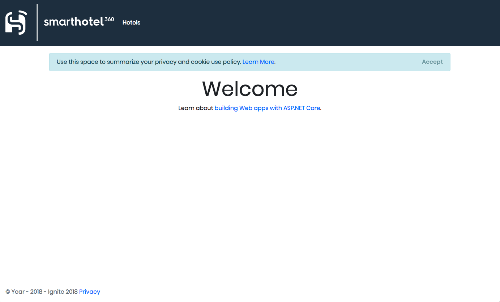
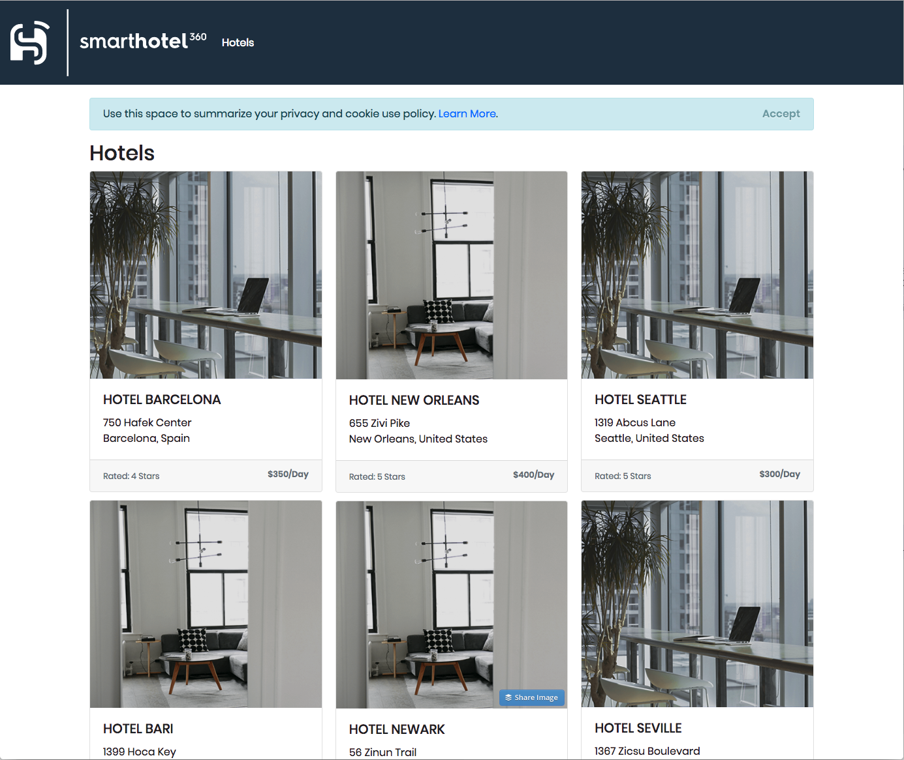

# SmartHotel360
During **Connect(); 2017** event this year we presented beautiful app demos using Xamarin and many features of Azure. For //build/ 2018's keynote, we updated some components of the back-end API code to support **Azure Kubernetes Service (AKS)**. This repository contains the setup instructions and sample code needed to repeat the [AKS and Azure Dev Spaces demo](https://www.youtube.com/watch?v=rd0Rd8w3FZ0&feature=youtu.be&t=8890) from //build/ 2018. 

# SmartHotel360 Repos
For this reference app scenario, we built several consumer and line-of-business apps and an Azure backend. You can find all SmartHotel360 repos in the following locations:

* [SmartHotel360 ](https://github.com/Microsoft/SmartHotel360)
* [IoT Demo](https://github.com/Microsoft/SmartHotel360-IoT)
* [Backend Services (optimized for Kubernetes)](https://github.com/Microsoft/SmartHotel360-AKS-DevSpaces-Demo)
* [Public Website](https://github.com/Microsoft/SmartHotel360-public-web)
* [Pet Checker Serverless Function](https://github.com/Microsoft/SmartHotel360-PetCheckerFunction)
* [Mobile Apps](https://github.com/Microsoft/SmartHotel360-mobile-desktop-apps)
* [Sentiment Analysis](https://github.com/Microsoft/SmartHotel360-Sentiment-Analysis-App)
* [Migrating Internal apps to Azure](https://github.com/Microsoft/SmartHotel360-internal-booking-apps)
* [Original Backend Services](https://github.com/Microsoft/SmartHotel360-Azure-backend)
* [Application Modernization](https://github.com/Microsoft/SmartHotel360-AppModernization)
* [How Containers Enable Local Development](https://github.com/microsoft/SmartHotel360-ContainersForLocalDev)

# SmartHotel360 - How Containers Enable Local Development

This example shows how to use SQL Server on Linux in a Docker container with and ASP.NET Core web application to display test data.

The test data is loaded into SQL Server using the `bcp` (Bulk Load Process) command line utility from an Excel generated CSV file.

```bash
/opt/mssql-tools/bin/bcp Hotels in data/Hotels.csv -S 0.0.0.0 -U sa -P $SA_PASSWORD -d Hotels -F2 -c -t ',' -e data/err.log
```

SQL Commands are scripted and executing to create and modify the schema and table structures before and after the data import to prepare the database for the application to run.

All of these processes happen by using Docker Compose to build and run the containers

```bash
# shortcut bash file
cd src
# run ./build.sh
./build.sh
```

or

```bash
docker-compose build

docker-compose up
```

Browse to http://localhost:5000

Home Page - ASP.NET Core 2.2 Razor Page Application



Hotels Page



# Contributing

This project welcomes contributions and suggestions.  Most contributions require you to agree to a Contributor License Agreement (CLA) declaring that you have the right to, and actually do, grant us the rights to use your contribution. For details, visit https://cla.microsoft.com/?WT.mc_id=dotnet-0000-shboyer.

When you submit a pull request, a CLA-bot will automatically determine whether you need to provide a CLA and decorate the PR appropriately (e.g., label, comment). Simply follow the instructions provided by the bot. You will only need to do this once across all repos using our CLA.

This project has adopted the [Microsoft Open Source Code of Conduct](https://opensource.microsoft.com/codeofconduct/?WT.mc_id=dotnet-0000-shboyer).
For more information see the [Code of Conduct FAQ](https://opensource.microsoft.com/codeofconduct/faq/?WT.mc_id=dotnet-0000-shboyer) or contact [opencode@microsoft.com](mailto:opencode@microsoft.com) with any additional questions or comments.


